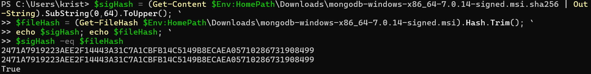
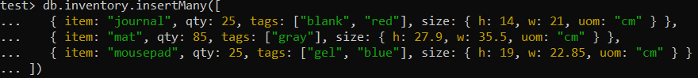
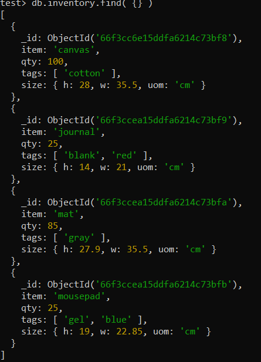
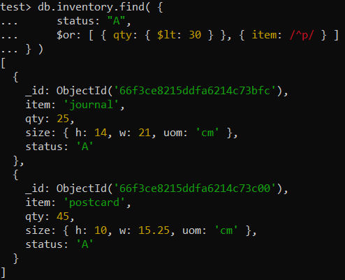
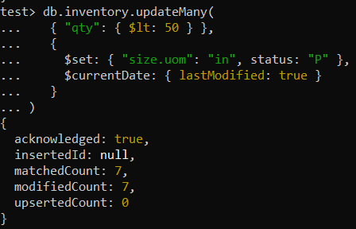
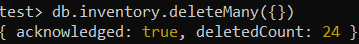
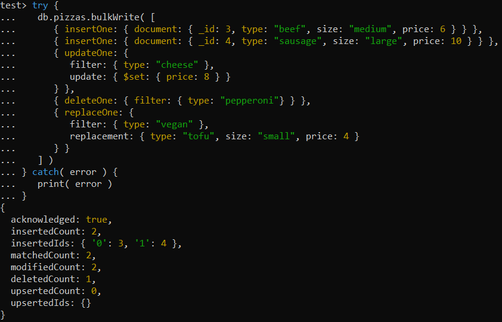
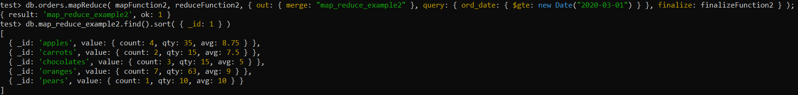
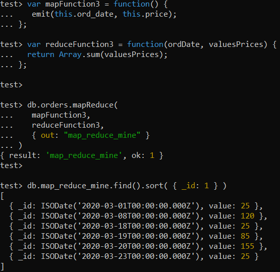

## Expass5 Report

### Correct validation of the installation package: 

### Relevant results obtained from Experiment 1:
**Insert:** 

**Query:**

 

**Update:** 

**Delete:**

**Bulk Write:**

### Experiment 2 example working:

### Experiment 2 operation made by me:

This map-reduce operation is useful because now you can see the total price per date any product was ordered. This informs us about which days were the most or least valuable.